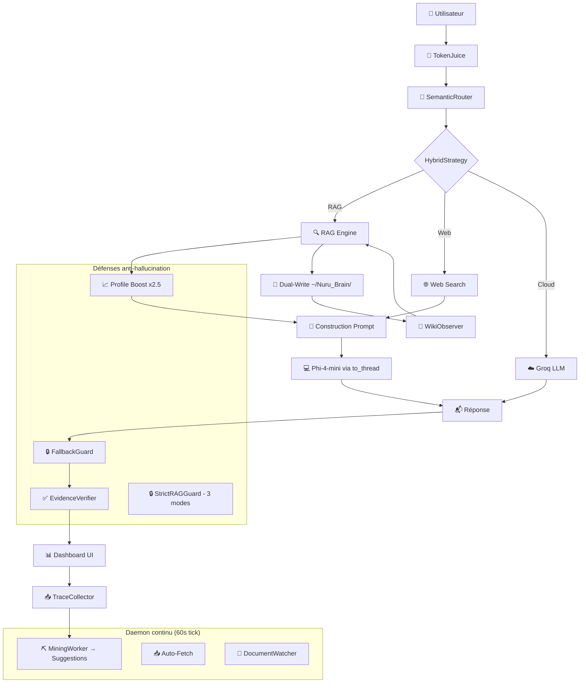

# NURU V6 — Bilan final d'implémentation

**Version** : 6.0 (finalisée)
**Date** : 2026-06-05
**Cible** : MacBook Pro M1 — 8 Go RAM unifiée
**Base** : NURU V4.5 (Phases 0-4) + NURU V5 (Correctifs stabilité)

---

## Table des Matières

1. [Vue d'ensemble](#1-vue-densemble)
2. [Nouveaux modules V6](#2-nouveaux-modules-v6)
3. [Correctifs critiques](#3-correctifs-critiques)
4. [Améliorations UI](#4-améliorations-ui)
5. [Architecture finale](#5-architecture-finale)
6. [Stack technique](#6-stack-technique)
7. [Arborescence](#7-arborescence)
8. [Tests](#8-tests)
9. [Roadmap](#9-roadmap)

---

## 1. Vue d'ensemble

NURU V6 est un assistant IA local pour Apple Silicon M1 (8 Go RAM). Il combine :

- **5 nouveaux modules backend** inspirés d'OpenJarvis et OpenHuman
- **10 correctifs critiques** (event loop, mémoire, hallucinations)
- **Refonte complète de l'interface** (3 colonnes, thème sobre, zone CoT)
- **Profile Boost** pour prioriser les documents personnels

Le tout fonctionne dans un **pipeline asynchrone unifié** (qasync) sans jamais geler l'interface.

---

## 2. Nouveaux modules V6

### E1 — TokenJuice 🧃

**Fichier** : `src/token_juice.py` (234 lignes)
**Inspiration** : OpenHuman — TokenJuice (-80% tokens)

Middleware de compression de contexte à 2 points d'injection :
1. **Avant le SemanticRouter** : compression de la requête utilisateur
2. **Après le RAG** : compression des chunks avant envoi au LLM

**Règles** : HTML→Markdown, troncature URLs longues, dédup lignes, crush logs/timestamps
**Bénéfice** : ~0.5 Go RAM économisé — moins de fallback cloud prématuré
**Tests** : ✅ 20 tests unitaires

### E2 — Dual-Write Mémoire (Nuru_Brain) 🌲

**Fichier** : `src/nuru_brain.py` (185 lignes)
**Inspiration** : OpenHuman — Memory Tree + Obsidian vault

Chaque chunk RAG est écrit en Markdown dans `~/Nuru_Brain/sources/` :
- En-tête YAML (source, date, hash, tags)
- Ouvrable dans Obsidian, VS Code ou n'importe quel éditeur
- Watchdog bidirectionnel : modification manuelle → ré-indexation

**Injection** : dans `ingestion.py` après `rag.add_chunks()`
**Config** : `nuru_brain_enabled: true` dans settings.yaml

### E3 — Learning Loop 📝

**Fichier** : `src/learning/trace_collector.py` + `src/learning/miner.py`
**Inspiration** : OpenJarvis — Learning Loop (traces → mining → évolution)

**TraceCollector** : enregistre chaque interaction (query, réponse, mode, feedback) dans SQLite via queue async
**MiningWorker** : analyse les patterns d'échec — mauvais routage, faibles confiances, mots récurrents
**Intégration** : appelé dans `orchestrator.py` après chaque réponse + daemon continu toutes les 10 min

### E4 — Auto-Fetch 📥

**Fichier** : `src/auto_fetch.py` (145 lignes)
**Inspiration** : OpenHuman — Sync périodique toutes les 20 min

Scan des dossiers Workspace et Downloads avec détection par hash MD5.
Seuls les fichiers nouveaux ou modifiés sont indexés.
**Désactivé par défaut** (économe en RAM). Activation dans settings.yaml.

### E5 — Stratégies Hybrides 🔀

**Fichier** : `src/core/router.py` + injection dans `orchestrator.py`
**Inspiration** : OpenJarvis — 8 paradigmes hybrides (Archon, Verify, Minions...)

4 stratégies :
| Mode | Principe | Cas d'usage |
|------|----------|-------------|
| `local_only` | Phi-4-mini répond seul (défaut) | Questions simples, conversation |
| `verify` | Phi-4-mini répond, Groq vérifie | Réponses importantes |
| `plan` | Groq planifie, Phi-4-mini exécute | Tâches multi-étapes |
| `rag` (Archon) | RAG locale récupère, Groq synthétise | Documents denses |

> **Note** : le mode `local_only` est recommandé pour les questions personnelles. Groq (mode Archon) a tendance à halluciner même avec instruction RAG stricte.

### E6 — Profile Boost 📈

**Fichier** : `src/profile_boost.py`
**Problème** : 446 sources dans l'index RAG, dont seulement ~20 docs personnels.
**Solution** : boost de score x2.5 pour CV et lettres de motivation de Leblanc, x2.0 pour attestations.

Injection dans `rag_engine.py` juste après la fusion RRF — les docs personnels remontent mécaniquement en tête.

---

## 3. Correctifs critiques

| # | Problème | Fichier | Correctif | Impact |
|---|----------|---------|-----------|--------|
| 1 | **Lock Hugging Face** bloquait le chargement | `~/.cache/hf/hub/.locks/` | `rm -rf` | ✅ NURU démarre |
| 2A | **Event Loop bloquée** par streaming MLX synchrone | `llm_local.py` | `await asyncio.sleep(0)` | ✅ UI fluide |
| 2B | **AttributeError** sur `None.lower()` | `llm_local.py` | `str().lower()` | ✅ Pas de crash |
| 3 | **Reranker crash** sur 1 seul document | `reranker.py` | `np.atleast_1d(scores)` | ✅ Pas de crash |
| 4 | **Chargement MLX synchrone** gelait l'UI (3-8s) | `llm_local.py` | `asyncio.to_thread()` | ✅ UI réactive |
| 5 | **Fuite tâches TTS** — GC tuait l'audio en cours | `nuru_core.py` | `set` de strong refs + autodiscard | ✅ Audio stable |
| 6 | **Timeout réseau 2s** bloquait l'UI en offline | `nuru_core.py` | Réduit à **0.5s** | ✅ Pas de lag |
| 7 | **Faux positifs RAG** — "fao" dans "il faudrait" | `semantic_router.py` | Regex `\b` | ✅ Routage précis |
| 8 | **Extraction post-session** freeze l'UI | `nuru_core.py` | `asyncio.to_thread()` + background | ✅ Pas de micro-freeze |
| 9 | **TPS faussé** — incluait le TTFT | `nuru_core.py` | Chrono au premier token | ✅ Métriques justes |
| 10 | **Prompt système assemblé manuellement** | `nuru_core.py` | Signalé — à migrer vers `apply_chat_template` | 🔜 Futur |

---

## 4. Améliorations UI

### Layout 3 colonnes

```
┌──────────────┬─────────────────────────────┬──────────────────┐
│   Sidebar    │    Chat Central              │   Colonne Droite  │
│  (260px)     │    (QStackedWidget)          │   (320px fixe)    │
│              │                             │                   │
│  NURU v6.0   │  [Bulles Neon]             │   RAM 2.3/8.0G    │
│  +Nouveau    │  [Indicateur de frappe ▊]   │   TOK/S    RAG    │
│  Base Doc.   │  [Zone de saisie]          │   12.5     0.72   │
│  Paramètres  │                             │   MODE local      │
│  Système V6  │                             │   ─────────────   │
│              │                             │   🧠 RAISONNEMENT │
│  Raccourcis  │                             │   [CoT en direct] │
│              │                             │                   │
│  © 2026      │                             │   Phi-4-mini Groq │
└──────────────┴─────────────────────────────┴──────────────────┘
```

### Nouveau thème (fini le violet)

| Élément | Couleur | Usage |
|---------|---------|-------|
| Fond | `#0D1117` | Panneaux, sidebar |
| Cartes | `#161B22` | Métriques, CoT |
| Bordures | `#1F2937` | Séparations subtiles |
| Bleu | `#00A3FF` | Accent principal, boutons |
| Vert | `#39FF14` | Secondaire, données, RAM |
| Ambre | `#FFB000` | Alertes, mode hybride |
| Texte | `#E5E7EB` | Contenu principal |
| Secondaire | `#6B7280` | Labels, hints |

### Nouveaux composants

- **ChatBubble V6** : avatars neon 🧠/👤, bordure gauche colorée, badge ⚡ IA
- **TypingIndicator** : curseur `▊` clignotant rose pendant la génération
- **Zone CoT** : `🧠 RAISONNEMENT` dans la colonne droite — affiche le chain of thought en direct
- **Transition animée** : fondu 250ms entre les pages du dashboard
- **Overlay fond** : calque `rgba(13, 17, 23, 0.25)` par-dessus la photo pour lisibilité

---

## 5. Architecture finale



---

## 6. Stack technique

### Noyau

| Couche | Technologie | Version |
|--------|-------------|---------|
| Langage | Python | 3.11+ |
| LLM Local | MLX (Phi-4-mini 4-bit) | ~12 tok/s M1 |
| LLM Cloud | Groq API | Llama 3.3 70B |
| Embeddings | multilingual-e5-base-mlx | 768d |
| Reranker | sentence-transformers MiniLM | Conditionnel |
| Vector DB | sqlite-vec | Native SQLite |
| BM25 | FTS5 Porter | SQLite natif |

### Interface

| Couche | Technologie |
|--------|-------------|
| UI Framework | PySide6 |
| Async Bridge | qasync |
| Thème | QSS custom (sobre #0D1117) |
| Animations | QPropertyAnimation |

### Monitoring

| Métrique | Outil |
|----------|-------|
| RAM | psutil (via TelemetryViewModel) |
| Tokens/s | Comptage local + chrono au 1er token |
| Score RAG | Confidence Gate V4.2 |
| Traces | SQLite + TraceCollector |

---

## 7. Arborescence

```
📦 Assistant-IA/
├── 📄 nuru_dashboard.py          # Entry point + daemon continu qasync
├── 📄 test_ask.py                # Test CLI pipeline
├── 📄 README.md                  # Documentation GitHub
├── 📄 NURU-V5.md                 # Documentation V5 (historique)
├── 📄 NURU-V6.md                 # ← Ce document
├── 📄 pyproject.toml
│
├── 📂 src/
│   ├── 📂 core/                  # Pipeline principal
│   │   ├── orchestrator.py       # Route → RAG → Gen → Mémoire + TokenJuice
│   │   ├── router.py             # SemanticRouter + HybridStrategy V6
│   │   ├── query_context.py      # Contexte immutable + hybrid_strategy
│   │   ├── response_guard.py     # StrictRAGGuard (3 modes)
│   │   ├── policies.py           # PolicyEngine (RAM, confiance)
│   │   ├── inference_worker.py   # Worker QThreadPool
│   │   └── events.py             # EventBus
│   │
│   ├── 📂 learning/              # V6 — Learning Loop
│   │   ├── trace_collector.py    # Traces SQLite asynchrones
│   │   └── miner.py              # Analyse patterns d'échec
│   │
│   ├── 📂 rag/                   # RAG Engine
│   │   ├── chunking.py           # SemanticChunker
│   │   ├── retrieval.py          # RRF Fusion
│   │   ├── compression.py        # Regex compression
│   │   └── citations.py          # Builder [Source:]
│   │
│   ├── 📂 ui/                    # Interface PySide6
│   │   ├── dashboard.py          # CyberDashboard 3 colonnes
│   │   ├── styles.qss            # Thème sobre #0D1117
│   │   ├── overlay.py            # Overlay transparent V6
│   │   ├── 📂 components/
│   │   │   ├── chat_bubble.py    # Neon bubbles + TypingIndicator
│   │   │   ├── console_page.py   # Chat + zone CoT
│   │   │   ├── v6_system_page.py # Page monitoring V6
│   │   │   ├── settings_page.py  # Paramètres
│   │   │   ├── metric_card.py    # Cartes métriques
│   │   │   └── circular_gauge.py # Jauges circulaires
│   │   ├── 📂 state/             # Store immutable
│   │   └── 📂 viewmodels/        # TelemetryViewModel
│   │
│   ├── token_juice.py            # V6 — Middleware compression
│   ├── nuru_brain.py             # V6 — Dual-Write Wiki
│   ├── auto_fetch.py             # V6 — Scan périodique
│   ├── profile_boost.py          # V6 — Boost x2.5 docs personnels
│   ├── semantic_router.py        # Routeur 5 niveaux (regex \b fixé)
│   ├── rag_engine.py             # Moteur RAG + Profile Boost
│   ├── llm_local.py              # Phi-4-mini (to_thread + sleep(0))
│   ├── llm_cloud.py              # Groq/Gemini/DeepSeek/OpeñRouter
│   ├── embedder.py               # MLX embeddings
│   ├── reranker.py               # Cross-encoder (np.atleast_1d)
│   ├── memory_store.py           # STM + cache sémantique
│   ├── gold_memory.py            # Corrections persistantes
│   ├── ingestion.py              # Indexation + Dual-Write
│   ├── nuru_core.py              # Orchestrateur legacy
│   ├── config.py                 # Singleton Pydantic
│   └── extraction.py             # PostSessionExtractor
│
│   └── 📂 infra/
│       └── cache.py              # TTLDecisionCache
│
├── 📂 tests/
│   ├── test_token_juice.py       # 20 tests V6
│   ├── test_v45_modules.py       # 12 tests legacy
│   └── test_semantic_router.py   # Tests routeur
│
├── 📂 config/
│   └── settings.yaml             # Configuration utilisateur V6
│
├── 📂 data/                      # Documents source
├── 📂 indexes/                   # sqlite-vec DB
├── 📂 logs/                      # Logs (rotation 10 MB)
├── 📂 models/                    # Modèles MLX locaux
│
└── 📂 ~/Nuru_Brain/              # V6 — Wiki Markdown persistant
    ├── 📂 sources/               # Chunks exportés
    ├── 📂 topics/                # Résumés thématiques
    └── index.md
```

---

## 8. Tests

```bash
# Tests unitaires V6
python3 tests/test_token_juice.py

# Pipeline complet
python3 test_ask.py

# Dashboard
python3 nuru_dashboard.py
```

---

## 9. Roadmap

| Priorité | Chantier | Statut |
|----------|----------|--------|
| ✅ V5 | Correctifs hallucinations | ✅ Complété |
| ✅ V6 | TokenJuice | ✅ Implémenté |
| ✅ V6 | Nuru_Brain | ✅ Implémenté |
| ✅ V6 | Learning Loop | ✅ Implémenté |
| ✅ V6 | Auto-Fetch | ✅ Implémenté |
| ✅ V6 | Stratégies Hybrides | ✅ Implémenté |
| ✅ V6 | Profile Boost | ✅ Implémenté |
| ✅ V6 | 10 correctifs critiques | ✅ Appliqués |
| ✅ V6 | Refonte UI 3 colonnes | ✅ Complété |
| 🔜 | `apply_chat_template` natif | À migrer |
| 🔜 | Support OCR Tesseract | Phase 2 |
| 🔜 | Cache sémantique étendu | Phase 3 |

---

*Document d'architecture V6 (v1.0) — Bilan final des 5 chantiers + 10 correctifs. Mis à jour le 2026-06-05.*
