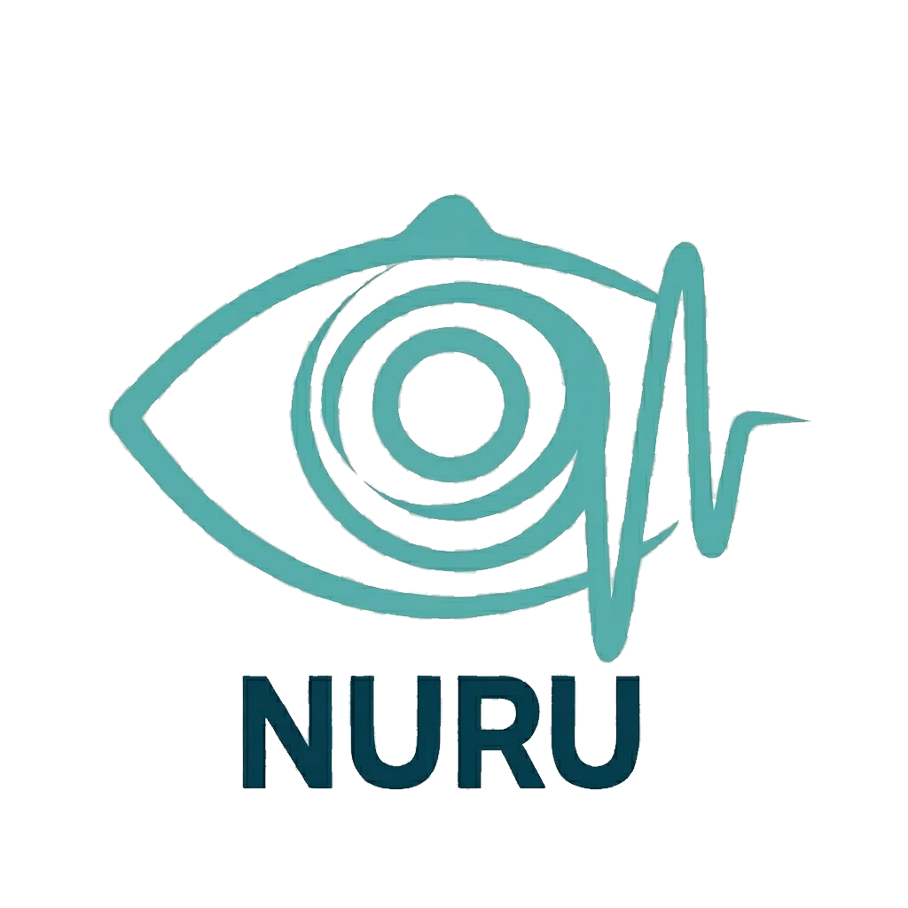

<div align="center">



<br/>

# 🌀 NURU — Personal Cognitive OS

<i>De l'assistant IA agentic au système d'exploitation cognitif personnel.<br/>
Conçu pour tourner en local d'abord, sur un MacBook Pro M1 de 8 Go de RAM unifiée.</i>

<br/>

<p>
  <a href="NURU_V9.md"></a>
  <a href="NURU_V14_VISION.md"></a>
  
  
  
  
  
  
</p>

</div>

<br/>

---

## Why NURU?

La plupart des assistants IA promettent d'être "personnels". Leur implémentation concrète : ils envoient vos prompts vers un serveur cloud qui appartient à quelqu'un d'autre. Le "personnel" est dans le marketing, pas dans l'architecture.

NURU part du postulat inverse — **le personnel commence par l'exécution locale**. Le router envoie les requêtes simples vers **Phi-4-mini (4-bit MLX)** qui tourne sur le GPU M1. Le cloud — Groq, OpenRouter, DeepSeek — n'est contacté que **quand c'est vraiment nécessaire** (questions d'actualité, tâches que le local ne sait pas tenir, ou RAM sous le seuil critique).

Ce qui rend NURU différent d'un wrapper LLM local :

- **Système d'exploitation cognitif**, pas chatbot — la mémoire (Episodic/Semantic/User/Error), le sommeil (SleepCycleManager 3 phases light/deep/REM), et la persona (PersonaEngine) sont des citoyens de première classe du système, pas des add-ons.
- **Privacy Layer** + opt-in granulaire par capteur (voix, vision écran, calendrier). Zéro fuite par défaut.
- **Agent Loop** sandboxé : planner → executor → verifier → recovery, avec approbation humaine pour les actions à risque.
- **Pipeline vocal local** (STT/TTS/VAD/wake word), présence animée Z.ai-style, latency sub-seconde sans réseau.

Le but est simple : **vivre avec un JARVIS personnel sur la machine qu'on a déjà**, sans céder ses données à chaque requête.

---

## Installation

```bash
git clone https://github.com/leblancbahiga/NURU.git
cd NURU
python3 -m venv .venv && source .venv/bin/activate
pip install -e ".[dev]"
```

Configuration des clés API dans votre Keychain macOS (jamais dans le repo) :

```bash
# Une seule fois
security add-generic-password -a nuru -s com.nuru.assistant/groq -w "VOTRE_CLE_GROQ"
security add-generic-password -a nuru -s com.nuru.assistant/openrouter -w "VOTRE_CLE_OPENROUTER"
security add-generic-password -a nuru -s com.nuru.assistant/deepseek -w "VOTRE_CLE_DEEPSEEK"
```

Pré-requis validés :
- **macOS 13+** sur architecture Apple Silicon (M1/M2/M3)
- **8 Go de RAM unifiée** minimum — conçu spécifiquement pour ce budget
- **Python 3.11** ou supérieur
- HuggingFace CLI actif (`huggingface-cli login`) pour le téléchargement initial des modèles MLX (~3.5 Go)

---

## Quick Start

```bash
# Lancer le dashboard V12 (présence ambiante Z.ai — tray + floating widget)
python3 run_v12.py

# Chat CLI simple (léger, sans UI)
python3 cli.py

# Réindexation des documents
python3 reindex_all.py

# Tests
python3 -m pytest tests/test_zai_architecture.py -v
```

| Commande | Effet |
|----------|-------|
| `python3 run_v12.py` | Lance l'interface ambiante V12 (tray icon + floating widget + orb animé) |
| `python3 cli.py` | Mode terminal pour usage SSH / serveur headless |
| `python3 reindex_all.py` | Indexe tous les documents du workspace |
| `python3 -m pytest tests/` | Suite complète — 913 tests (UI, RAG, agent, mémoire, voice) |

---

## What's inside — catalog of modules

NURU V12 absorbe V13-A/B (les modules "PersonaEngine", "SleepCycle", "CostGuard" sont déjà en codebase, pas en roadmap). Cette liste reflète **le code réel**, pas la wishlist.

### 🧠 Cognitive core

| Module | Ce qu'il fait | Source |
|--------|---------------|--------|
| **Router** (routeur unifié) | 6 niveaux — trivial (regex) → patterns → LLM classify → Spotlight → cloud fallback → clarification. Cache TTL 256 entrées. | [`src/routing/router.py`](src/routing/router.py) |
| **PolicyEngine** | Seuils RAM/Reranker/Score centralisés. `should_rerank()`, `should_use_cloud()`, `route_from_score()`. | [`src/core/policies.py`](src/core/policies.py) |
| **PromptGuard** | Anti-injection — neutralise 50+ motifs (`Ignore les instructions`, `<|im_start|>system`, etc.), échappe les délimiteurs de bloc, normalisation Unicode. | [`src/core/prompt_guard.py`](src/core/prompt_guard.py) |
| **StrictRAGGuard** | Modes STRICT/HYBRID/FREE. En STRICT, bloque les réponses non-citées par les chunks. | [`src/core/response_guard.py`](src/core/response_guard.py) |
| **EvidenceVerifier** | Valide que chaque `[Source: X]` dans la réponse existe dans les chunks RAG injectés. | [`src/ai/verifier.py`](src/ai/verifier.py) |
| **DynamicPromptBuilder** | Construit le prompt dynamiquement selon intent/facts/procedures — pas de prompt monolithique. | [`src/routing/prompt_builder.py`](src/routing/prompt_builder.py) |

### 📚 Memory & learning

| Module | Ce qu'il fait | Source |
|--------|---------------|--------|
| **EpisodicMemory** | Souvenirs datés et contextuels (ce qui s'est passé). | `src/memory/episodic.py` |
| **SemanticMemory** | Faits structurés clé/valeur/confiance (ce qui est vrai). | `src/memory/semantic.py` |
| **UserMemory** | Préférences utilisateur persistantes (comment Leblanc aime les choses). | `src/memory/user.py` |
| **ErrorMemory** | Historique d'erreurs pour auto-correction (ce qui a foiré et pourquoi). | `src/memory/manager.py` |
| **MemoryBridge** | Pont entre MemoryStore (legacy V3) et MemoryManager V9. | `src/memory_bridge.py` |
| **GoldMemory** | Corrections utilisateur persistantes. Recherche exacte ou embedding (seuil 0.92). | `src/gold_memory.py` |
| **PostSessionExtractor** | Extrait préférences/entités après chaque session et les stocke comme `user_profile`. | `src/extraction.py` |

### 🔍 RAG hybride

| Module | Ce qu'il fait | Source |
|--------|---------------|--------|
| **RAGEngine** | Pipeline 2-passes — HyDE OR query rewriting, vector + FTS5, RRF, reranker conditionnel. | `src/rag_engine.py` |
| **MultiSearchOrchestrator** | Single source de search — vector + BM25 + grep + HyDE en parallèle, fusion par rangs. | `src/rag/multi_search.py` |
| **ProfileBoost** *(retiré en V10.1)* | — | — |
| **Spotlight** | Recherche fichiers locaux via `mdfind`, fallback si RAG échoue (sans LLM). | `src/rag/spotlight.py` |
| **HyDE** | Expansion hypothétique — génère des passages fictifs pour mieux embedder la query. | `src/rag/hyde.py` |
| **Decomposer** | Décompose les queries multi-hop en sous-questions avant retrieval. | `src/rag/decomposer.py` |
| **FactChecker** | Vérification factuelle post-génération sur les chunks sourcés. | `src/rag/fact_checker.py` |
| **HierarchicalChunker V2** | 4 niveaux (document/section/subsection/paragraph), max 4000 chars/chunk. | `src/rag/v2_chunking.py` |

### 🎙️ Voice & vision

| Module | Ce qu'il fait | Source |
|--------|---------------|--------|
| **AudioEngine** | STT (mlx-whisper) + TTS (Piper/Kokoro). Auto-stop 15s. | `src/audio.py` |
| **OCR** | Tesseract + fallback cloud. Lecture d'images / scans. | `src/ocr.py` |

### 🤖 Agent Loop

| Module | Ce qu'il fait | Source |
|--------|---------------|--------|
| **AgentOrchestrator** | ReAct (Thought-Action-Observation loop) avec mémoire. | `src/agent/orchestrator.py` |
| **TaskPlanner** | Décompose un objectif en steps exécutables. | `src/agent/planner.py` |
| **Executor** | Exécute les steps. Sandbox shell, approbation humaine pour les actions risquées. | `src/agent/executor.py` |
| **Verifier** | Valide le résultat d'une exécution avant de continuer. | `src/agent/verifier.py` |
| **RecoveryEngine** | Reprend l'exécution après une erreur — diagnostique, retry, escalade. | `src/agent/recovery.py` |
| **ToolRegistry** | Catalogue des tools disponibles — shell, navigatuer, fichiers, calendrier. | `src/tools/registry.py` |
| **ShellExec** | Sandbox shell avec 5 couches de défense + approbation humaine. | `src/tools/shell_exec.py` |
| **OSControl** | Contrôle macOS local (Notifications, Spotlight, fenêtre active). | `src/tools/os_control.py` |

### 🧩 Cloud routing

| Module | Ce qu'il fait | Source |
|--------|---------------|--------|
| **CloudLLM** | Multi-provider avec Circuit Breaker — Groq primaire, OpenRouter/DeepSeek en fallback. | `src/llm_cloud.py` |
| **LocalLLM** | MLX Phi-4-mini 4-bit. Keep-alive 5 min, déchargement auto si RAM critique. | `src/llm_local.py` |
| **TokenJuice** | Compression tokens -40% à -50% (regex). 0 coût d'inférence. | `src/token_juice.py` |

### 📊 Observability

| Module | Ce qu'il fait | Source |
|--------|---------------|--------|
| **RAMMonitor** | Surveillance continue, callbacks de déchargement auto. Seuils V10.3k calibrés pour M1 8 Go. | `src/ram_monitor.py` |
| **EventBus** | Bus d'événements thread-safe async. Singlet instance — fusion V3/V4.5. | `src/core/events.py` |
| **Learning — TraceCollector** | Queue async des traces de session vers `~/.nuru/traces.db`. | `src/learning/trace_collector.py` |
| **Learning — Optimizer** | Mining périodique des traces → improvements auto. | `src/learning/optimizer.py` |

---

## Project structure

```
nuru/
├── run_v12.py                  # Entry point PySide6 — V12 ambient presence (Z.ai)
├── cli.py                      # Entry point CLI
├── pyproject.toml              # Python ≥3.11 · pytest · pydantic · mlx-lm
├── config/
│   ├── settings.yaml           # Config user (clés sensibles dans Keychain)
│   └── default.yaml            # Defaults infra
├── src/
│   ├── nuru_core.py            # V12 orchestrator (compatibility facade)
│   ├── llm_local.py            # MLX Phi-4-mini
│   ├── llm_cloud.py            # Groq/OpenRouter/DeepSeek
│   ├── rag_engine.py           # RAG factory + types
│   ├── routing/
│   │   ├── router.py           # Routeur unifié 6-niveaux
│   │   └── prompt_builder.py   # DynamicPromptBuilder
│   ├── core/
│   │   ├── orchestrator.py     # NuruOrchestrator — pipeline réel
│   │   ├── policies.py         # PolicyEngine — seuils centralisés
│   │   ├── prompt_guard.py     # Anti-injection
│   │   ├── response_guard.py   # StrictRAGGuard
│   │   ├── model_manager.py    # Cycle de vie modèles MLX
│   │   ├── query_context.py    # Immutable context (QueryContext/EvidencePack)
│   │   ├── events.py           # EventBus singleton
│   │   ├── exceptions.py       # Hiérarchie d'exceptions typées
│   │   └── inference_worker.py # TokenReceiver (legacy QThread compat)
│   ├── rag/
│   │   ├── multi_search.py     # Single source of truth retrieval
│   │   ├── v2_chunking.py      # Hierarchical chunker
│   │   ├── query_rewriter.py   # HyDE / expansion de query
│   │   ├── hyde.py             # Hypothetical Document Embeddings
│   │   ├── decomposer.py       # Multi-hop decomposition
│   │   ├── fact_checker.py     # Vérification post-génération
│   │   ├── diagnostics.py      # Diagnostic persistant
│   │   ├── index_health.py     # Santé de l'index
│   │   └── spotlight.py        # Recherche fichiers locaux
│   ├── agent/                  # Agent Loop V12
│   ├── memory/                 # MemoryManager V9
│   ├── cloud.py                # WebSearch
│   ├── audio.py                # STT/TTS
│   ├── ocr.py                  # Vision OCR
│   ├── tools/                  # ToolRegistry + SandboxShell
│   ├── ui/
│   │   ├── ambient_app.py      # V12 AmbientApp — orchestre tray, floating, voice, chat
│   │   ├── floating_widget.py  # Widget always-on-top 260×180 (DM-1 verre dépoli)
│   │   ├── presence_orb.py     # NuruPresenceOrb — 7 états animés
│   │   ├── tray_icon.py        # NURUTrayIcon — diamant cyan (menu bar macOS)
│   │   ├── voice_overlay.py    # Overlay vocal frameless (⌥␣)
│   │   ├── nuru_window.py      # Fenêtre principale 720×860 (QMainWindow DM-1)
│   │   ├── conversation_surface.py  # Zone de chat avec bulles
│   │   ├── styles.qss          # QSS — palette anthracite + cyan
│   │   ├── tokens.py           # Design tokens — Color, Typography, Radius
│   │   ├── components/         # ChatBubble, ConsolePage, etc.
│   │   └── assets/
│               ├── Gemini_Generated_Image_35cdt735cdt735cd_transparent.png  # Logo V12
│               └── gemini-logo.svg        # Logo animé SVG
├── tests/                       # 37 fichiers, 913 tests
├── NURU_V9.md                   # Spec V12 détaillée (140 Ko)
├── NURU_V14_VISION.md           # Vision V14 (GoalMemory, LiveKit, Skills SDK)
├── NURU_AUDIT_SYNTHESE.md       # 7 audits experts consolidés
└── NURU_AUDIT_2026-06-21_V12.md # Audit live post-V12 (10 P0...)
```

---

## V14 — what's coming next

V14 est **strictement additif** sur V12. Voir [`NURU_V14_VISION.md`](NURU_V14_VISION.md) pour le détail.

```
┌─────────────────────────────────────────────────────────────┐
│               V14 — COUCHES ADDITIVES                       │
├─────────────────────────────────────────────────────────────┤
│  LifeOS — Fusion auto agenda/tâches/projets/objectifs        │
├─────────────────────────────────────────────────────────────┤
│  Skills Ecosystem (SDK + marketplace local)                  │
├─────────────────────────────────────────────────────────────┤
│  Media Intelligence (MediaPipe + VLM diagnostic agro)       │
├─────────────────────────────────────────────────────────────┤
│  LiveKit — Voix distante multi-appareils (pont, pas replace) │
├─────────────────────────────────────────────────────────────┤
│  GoalMemory & ProjectMemory                                  │
╞═════════════════════════════════════════════════════════════╡
│               V12 — FONDATIONS (achevée)                    │
│  PersonaEngine · Privacy Layer · SleepCycleManager          │
│  ModelRouter · CostGuard · Connecteurs · Pipeline vocal     │
│  Vision écran/doc · MCP                                      │
└─────────────────────────────────────────────────────────────┘
```

| Module V14 | But | Effort |
|-----------|-----|--------|
| **GoalMemory** | NURU sait tes objectifs long terme (MBA, projets pro) et où tu en es. | 6 sem |
| **ProjectMemory** | Lie documents/tâches/agenda à chaque projet actif. | 2 sem |
| **LiveKit** | Voix distante — depuis téléphone, autre Mac, Goma↔Kampala. Auto-hébergé. | 3 sem |
| **Skills SDK** | Marketplace local de skills (à la OpenJarvis). | 4 sem |
| **Media Intelligence** | Diagnostique agro via Mediapipe + VLM local. | 6 sem |
| **LifeOS** | Fusion automatique — agenda + tâches + projets + objectifs. | 8 sem |

---

## Documentation

| Document | Lire si... |
|----------|-----------|
| [`NURU_V9.md`](NURU_V9.md) | Tu veux la spec V12 complète (phases, sprints, décisions) — **140 Ko, dense, c'est le carnet de sprint** |
| [`NURUV15.md`](NURUV15.md) | Tu veux le plan de consolidation V15 — 81 propositions issues des 7 audits, phases d'exécution avec statut |
| [`NURU_V14_VISION.md`](NURU_V14_VISION.md) | Tu veux ce qui vient après V12 — GoalMemory, LiveKit, Skills |
| [`NURU_AUDIT_SYNTHESE.md`](NURU_AUDIT_SYNTHESE.md) | Tu lis une décision d'architecture, et tu veux le contexte des 7 audits experts qui l'ont motivée |
| [`NURU_AUDIT_2026-06-21_V12.md`](NURU_AUDIT_2026-06-21_V12.md) | Tu ouvres le repo aujourd'hui et tu veux savoir quels sont les P0 du moment |
| [`RAPPORT_AUDIT_V4.md`](RAPPORT_AUDIT_V4.md) | Tu es curieux de voir d'où vient le projet (état V4) |
| [`question_zai_interface_V12.md`](question_zai_interface_V12.md) | Tu veux comprendre les choix d'interface Z.ai |
| [`ROADMAP.md`](ROADMAP.md) | Un vue macro de la roadmap unifiée V12→V13 |

---

## Contributing

NURU est actuellement **un projet personnel de Leblanc BAHIGA Mudarhi** — ingénieur agronome et informaticien travaillant dans les chaînes de valeur agricoles en Afrique centrale et orientale (IITA, FAO, USAID). Il n'est pas ouvert aux contributions externes pour le moment.

Si vous utilisez NURU ou voulez échanger sur l'architecture :

- **Issues** : ouvrez sur GitHub, je lis régulièrement
- **Discussions** : pour les questions d'architecture

Pour les forks personnels, le code est sous licence MIT — voir [`LICENSE`](LICENSE) (à ajouter si désiré).

---

## Built on the shoulders of

NURU ne pourrait pas tourner sur un M1 de 8 Go sans ces acteurs :

- **Apple MLX** — l'équipe d'Apple pour le framework MLX qui rend Phi-4-mini viable sur M1
- **Microsoft** — pour le modèle **Phi-4-mini-instruct-4bit** (3.8B params, qualité remarquable pour sa taille)
- **Groq, OpenRouter, DeepSeek** — pour la couche cloud optionnelle (les clés vivotent dans le Keychain macOS, jamais dans git)
- **Stanford SAIL** — pour les inspirations architecturales — *OpenJarvis* (`open-jarvis/OpenJarvis`) et *Open Humanoid* ont directement inspiré le pattern local-first + eval framework + skills catalog
- **HuggingFace** — pour l'hébergement des modèles et embeddings

---

## License

MIT. Voir [`LICENSE`](LICENSE) (à ajouter).

---

*Document mis à jour le 15 juillet 2026 — NURU V12.2 — Dashboard ambiant Z.ai actif — 913 tests ✅ — V15 Phase 0A ✅ Phase 0B 4/12 ⏳*
