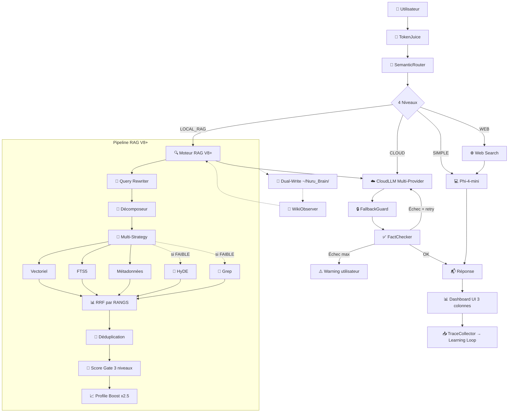

<div align="center">
  
  
  
  
  
</div>

<br/>

<h1 align="center">🌀 NURU — Assistant IA Local V8+</h1>
<p align="center">
  <i>Agentic RAG System for Apple Silicon — Multi-Strategy Search + Cloud Routing + Fact Verification</i>
</p>

<p align="center">
  <b>🇫🇷 Français</b> · Conçu pour MacBook Pro M1 (8 Go RAM unifiée) · <b>Privacy-first</b>
</p>

---

## ✨ Aperçu

**NURU V8+** est un assistant IA personnel **agentic** qui combine :
- Un **LLM local** (Phi-4-mini) pour le trivial et l'offline
- Un **LLM cloud multi-provider** (Groq, OpenCode Zen, OpenRouter, DeepSeek, Nvidia) avec circuit breaker et fallback automatique
- Un **moteur RAG hybride multi-stratégie** : Vectoriel + FTS5 + HyDE + Query Rewriting + Décomposition + RRF par rangs
- Un **vérificateur de faits** post-génération avec boucle de rétroaction
- Un système de **diagnostic temps réel** (stratégies, index health, métriques)
- Un **routage sémantique 4 niveaux** : SIMPLE → WEB → LOCAL_RAG → CLOUD
- Le tout dans une **interface PySide6 cyberpunk 3 colonnes** (anthracite #0D1117, bleu #00A3FF, vert #39FF14)

## 🚀 Fonctionnalités Clés V8+

| Composant | Technologie | Détails |
|-----------|-------------|---------|
| LLM Local (principal) | **Phi-4-mini-instruct 4-bit** (MLX) | ~2.5 Go RAM, ~12 tok/s sur M1 |
| LLM Local (fallback) | **Qwen 2.5 1.5B 4-bit** (MLX) | Ultra-léger |
| LLM Cloud (multi-provider) | **Groq** (Llama 3.3 70B) → **OpenRouter** → **DeepSeek** → **Nvidia** | Circuit Breaker + Fallback automatique |
| Routage CloudLLM | `src/llm_cloud.py` lit `settings.yaml` | Pas de fournisseur codé en dur |
| Embeddings | **multilingual-e5-base-mlx** | 768d, multilingue (FR/EN/Swahili) |
| Reranker | **cross-encoder/ms-marco-MiniLM-L6-v2** | Conditionnel (zone grise 0.40-0.75) |

### 🔍 RAG Hybride V8+

- **Stockage vectoriel** : sqlite-vec (768d)
- **BM25** : FTS5 avec tokenizer Porter (stemming français/anglais)
- **Multi-stratégie** : Vectoriel → FTS5 → Métadonnées → HyDE (si FAIBLE/ABSENT) → Grep (si FAIBLE/ABSENT)
- **Query Rewriting** : Reformulation Cloud via CloudLLM avant recherche
- **Décomposition** : Questions complexes scindées (max 3 sous-requêtes, circuit breaker)
- **Fusion** : Reciprocal Rank Fusion par **RANGS** (k=60), pas scores bruts
- **Déduplication sémantique** : cos > 0.90 → drop
- **Early stopping** : score > 0.75 → pas de stratégies lourdes
- **Profile Boost** : score x2.5 pour les documents personnels (CV, lettres de motivation)
- **Seuils** : `MIN_SCORE=0.40`, `FALLBACK_THRESHOLD=0.25`

### 🧠 Learning Loop

- **TraceCollector** : enregistre chaque interaction dans SQLite (queue async)
- **MiningWorker** : détecte les patterns d'échec — mauvais routage, faibles confiances
- **Rapports automatiques** : suggestions d'amélioration des seuils et prompts

### ✅ Fact Checker — Vérification post-génération

- **Vérification Cloud** : Chaque réponse RAG/COMPLEX est vérifiée via CloudLLM contre les sources
- **Boucle de rétroaction** : Si vérification échoue → 1 régénération max → sinon warning utilisateur
- **Protection anti-boucle** : Flag `already_fact_checked` + `already_retried_fact_check`
- **Budget distinct** : ~2500 tokens dédiés au vérificateur (pas de compétition avec la génération)
- **Émission EventBus** : `verification_warning` pour affichage dashboard

### 🧃 TokenJuice — Middleware de Compression

- Réduction de **40-60%** des tokens avant envoi au LLM
- Filtres : HTML→Markdown, troncature URLs, dédup, crush logs/timestamps
- **2 points d'injection** : avant routage + après RAG
- Économie **~0.5 Go RAM** sur M1 8 Go

### 🌲 Dual-Write Mémoire (Nuru_Brain)

- Chaque chunk RAG est écrit en Markdown dans `~/Nuru_Brain/`
- Ouvrable dans **Obsidian** ou VS Code
- Modification manuelle → ré-indexation automatique

### 🔀 Routage Intelligent (V8+)

| Mode | Principe | Cloud requis |
|------|----------|-------------|
| `SIMPLE` | Phi-4-mini répond seul (salutations, chitchat) | Non |
| `WEB` | Recherche web + Phi-4-mini | Non |
| `LOCAL_RAG` | RAG locale + Phi-4-mini | Non |
| `CLOUD_GROQ` | CloudLLM pour réponse RAG/COMPLEX | **Oui** |
| `offline` | Fallback Phi-4-mini + top_1 chunk tronqué | Non |

### 📥 Auto-Fetch

- Scan périodique des dossiers (Workspace, Downloads)
- Détection par hash MD5 — seuls les nouveaux fichiers sont indexés
- Désactivé par défaut (économe en RAM)

### 📊 Interface Desktop

- Dashboard PySide6 **3 colonnes** : Sidebar (260px) → Chat (QStackedWidget) → Panneau Droit Diagnostic (320px)
- **Thème sobre** : fond anthracite `#0D1117`, accents bleu électrique `#00A3FF`, vert `#39FF14`
- **Métriques temps réel** : RAM, Tok/s, Score RAG, Mode, Stratégie active
- **Panneau Diagnostic** : 3 onglets (Métriques, Index, Traces) avec FactCheckWidget, RetroBanner, StrategyDiagnostic
- **Zone de raisonnement** (CoT) : affiche le chain of thought dans la colonne droite
- **Bulles Neon** : avatars avec bordure colorée + badges de confiance/citations en ligne
- **TypingIndicator** : label de stratégie en cours (ex: "Multi-stratégie RAG en cours...")
- **Transition animée** : fondu entre les pages
- **Overlay fond** : calque sombre 25% pour lisibilité

---

## 🏗️ Architecture

```
┌─────────────────┬──────────────────────────┬──────────────────────┐
│   Sidebar        │   Chat Central            │   Colonne Métriques  │
│  (260px)         │   (QStackedWidget)        │   (320px fixe)       │
│                  │                           │                      │
│                  │   🧃 TokenJuice          │   RAM 2.3/8.0G       │
│                  │       ↓                   │   TOK/S   RAG   MODE │
│                  │   🧠 SemanticRouter       │   12.5    0.72  cloud│
│                  │     ├─ SIMPLE → Local     │   ──────────         │
│                  │     ├─ WEB    → Web       │   📊 DIAGNOSTIC      │
│                  │     ├─ RAG    → CloudLLM  │   Stratégie active   │
│                  │     └─ CLOUD  → CloudLLM  │   Index Health       │
│                  │       ↓                   │   Fact Check         │
│                  │   🔍 Pipeline RAG V8+     │   Traces Learning    │
│                  │   Query Rewriter          │   ──────────         │
│                  │   Décomposeur             │   🧠 RAISONNEMENT    │
│                  │   Multi-Strategy          │   [CoT en direct]    │
│                  │   RRF + Dedup             │                      │
│                  │   Score Gate 3 niveaux    │   CloudLLM · Phi-4   │
│                  │   Profile Boost x2.5      │                      │
│                  │       ↓                   │                      │
│                  │   ☁️ CloudLLM Multi-Prov  │                      │
│                  │       ↓                   │                      │
│                  │   ✅ FactChecker          │                      │
│                  │   + Boucle rétroaction    │                      │
│                  │       ↓                   │                      │
│                  │   📥 TraceCollector       │                      │
│                  │       ↓                   │                      │
│                  │   🌲 Nuru_Brain/          │                      │
└─────────────────┴──────────────────────────┴──────────────────────┘
```

### Pipeline détaillé



---

## 🐛 Corrections & Optimisations V6 → V8+

| # | Problème | Correctif |
|---|----------|-----------|
| 1 | **Lock Hugging Face** bloquant | `rm -rf ~/.cache/huggingface/hub/.locks/*` |
| 2 | **Event Loop bloquée** par streaming MLX | `await asyncio.sleep(0)` dans la boucle |
| 3 | **Reranker crash** sur résultat unique | `np.atleast_1d(scores)` |
| 4 | **Chargement MLX synchrone** gelait l'UI | `await asyncio.to_thread(self._load_model)` |
| 5 | **Fuite de tâches TTS** (GC tuait l'audio) | Strong references `background_tts_tasks` |
| 6 | **Timeout réseau 2s** bloquait l'UI | Réduit à **0.5s** |
| 7 | **Faux positifs RAG** (sous-chaîne "fao") | Regex `\b` (limite de mot) |
| 8 | **Extraction post-session** freeze l'UI | `asyncio.to_thread` + background task |
| 9 | **TPS faussé** (incluait TTFT) | Chrono au premier token |
| 10 | **Profile Boost** documents personnels | x2.5 CV, x2.0 attestations |

### Nouvelles optimisations V8+

| # | Amélioration | Module |
|---|--------------|--------|
| 11 | **Multi-Cloud circuit breaker** | `llm_cloud.py` |
| 12 | **RRF par rangs** (k=60), plus scores bruts | `rag/multi_search.py` |
| 13 | **Early stopping** si score > 0.75 | `rag/multi_search.py` |
| 14 | **Déduplication sémantique** cos > 0.90 | `rag/multi_search.py` |
| 15 | **FactChecker anti-boucle** | `rag/fact_checker.py` |
| 16 | **Décomposeur circuit breaker** (max 3) | `rag/decomposer.py` |
| 17 | **Check connectivité Cloud** 0.5s en tête | `nuru_core.py` |
| 18 | **Cache sémantique** avec diagnostic | `rag/memory_store.py` |
| 19 | **Index Health Check** | `rag/index_health.py` |
| 20 | **Diagnostics timing par stratégie** | `rag/diagnostics.py` |

---

## 📦 Installation

```bash
# Cloner
git clone https://github.com/leblancbahiga/Assistant-IA.git
cd Assistant-IA

# Environnement
python3 -m venv .venv
source .venv/bin/activate
pip install -e .

# Clés API (via Keychain macOS)
python3 -c "
import keyring
keyring.set_password('com.nuru.assistant', 'groq', 'votre_cle')
keyring.set_password('com.nuru.assistant', 'gemini', 'votre_cle')
"
```

---

## 🚀 Utilisation

```bash
# Lancer le dashboard
cd ~/Downloads/Assistant\ IA
python3 nuru_dashboard.py

# Test rapide en CLI
python3 test_ask.py
```

### Fichiers de configuration

| Fichier | Rôle |
|---------|------|
| `config/settings.yaml` | Configuration utilisateur (modèle, RAG, modes V6) |
| `src/config.py` | Singleton Pydantic    |
| `~/.nuru/traces.db` | Traces Learning Loop |
| `~/Nuru_Brain/` | Wiki persistant V6    |

---

## ⚙️ Configuration (config/settings.yaml)

```yaml
response_mode: "hybrid"              # strict | hybrid | free
rag_score_threshold: 0.40
rag_score_fallback: 0.25
rag_k: 5
local_model: "mlx-community/Phi-4-mini-instruct-4bit"
local_model_fallback: "mlx-community/Qwen2.5-1.5B-Instruct-4bit"
cloud_provider: "groq"               # groq | openrouter | deepseek | nvidia
cloud_model: "llama-3.3-70b-versatile"
cloud_fallback: "openrouter/deepseek/deepseek-v4-flash"
hybrid_mode: "cloud_first"           # cloud_first | local_only | verify | plan | rag
token_juice_enabled: true
learning_enabled: true
nuru_brain_enabled: true
auto_fetch_enabled: true
auto_fetch_interval_min: 30
cache_maxsize: 256
cache_ttl_seconds: 300
session_window: 5
stt_model: "small"
tts_enabled: true
tts_engine: "piper"
```

---

## 📁 Structure du Projet

```
📦 Assistant-IA/
├── 📄 nuru_dashboard.py          # Entry point PySide6 + daemon continu
├── 📄 index_docs.py              # Indexation documents principale
├── 📄 reindex_*.py               # Scripts de ré-indexation
├── 📄 test_ask.py                # Test CLI
├── 📄 README.md                  # ← Ce fichier
├── 📄 ROADMAP.md                 # État d'avancement
├── 📄 pyproject.toml
│
├── 📂 src/
│   ├── 📂 core/                  # Pipeline principal
│   │   ├── orchestrator.py       # NuruOrchestrator (route → RAG → gen → mémoire)
│   │   ├── router.py             # Routeur V5 avec PolicyEngine
│   │   ├── query_context.py      # Contexte immutable + flags boucle
│   │   ├── response_guard.py     # StrictRAGGuard (3 modes)
│   │   └── policies.py           # PolicyEngine
│   │
│   ├── 📂 rag/                   # RAG Engine V8+
│   │   ├── chunking.py           # SemanticChunker
│   │   ├── v2_chunking.py        # V2 amélioré
│   │   ├── retrieval.py          # RRF Fusion
│   │   ├── multi_search.py       # Orchestrateur multi-stratégie
│   │   ├── query_rewriter.py     # Reformulation Cloud
│   │   ├── hyde.py               # HyDE (Hypothetical Document Embedding)
│   │   ├── decomposer.py         # Décomposition questions
│   │   ├── file_search.py        # Grep + extraction PDF
│   │   ├── read_tool.py          # Décision de lecture Python
│   │   ├── fact_checker.py       # Vérificateur faits Cloud
│   │   ├── diagnostics.py        # Timing par stratégie
│   │   ├── index_health.py       # Index Health Check
│   │   ├── compression.py        # Compression de contexte
│   │   ├── citations.py          # Gestion des citations
│   │   └── memory_store.py       # Cache sémantique avec diagnostic
│   │
│   ├── 📂 learning/              # V6 — Learning Loop
│   │   ├── trace_collector.py    # Traces SQLite
│   │   └── miner.py              # Analyse patterns d'échec
│   │
│   ├── 📂 ui/                    # Interface PySide6
│   │   ├── dashboard.py          # CyberDashboard 3 colonnes
│   │   ├── overlay.py            # Calque fond
│   │   ├── styles.qss            # Thème sobre #0D1117
│   │   └── 📂 components/
│   │       ├── chat_bubble.py    # Bulles Neon + badges
│   │       ├── console_page.py   # Chat + zone CoT
│   │       ├── right_panel.py    # Panneau diagnostic (3 onglets)
│   │       ├── v6_system_page.py # Page Système V6
│   │       ├── settings_page.py
│   │       ├── logo_widget.py
│   │       └── ...
│   │
│   ├── 📂 infra/                 # Infrastructure
│   │   ├── cache.py              # TTLDecisionCache
│   │   ├── logging_setup.py
│   │   └── sqlite_compat.py
│   │
│   ├── 📂 ai/                    # Modules IA spécialisés
│   │   └── verifier.py           # EvidenceVerifier
│   │
│   ├── token_juice.py           # V6 — Compression
│   ├── nuru_brain.py            # V6 — Dual-Write Wiki
│   ├── auto_fetch.py            # V6 — Scan périodique
│   ├── profile_boost.py         # V6 — Boost documents personnels
│   ├── rag_engine.py            # Moteur RAG hybride
│   ├── llm_local.py             # Phi-4-mini (MLX)
│   ├── llm_cloud.py             # CloudLLM multi-provider
│   ├── semantic_router.py       # Routeur 4 niveaux
│   ├── embedder.py              # multilingual-e5-base-mlx
│   ├── reranker.py              # cross-encoder MiniLM
│   ├── config.py                # Singleton config
│   └── nuru_core.py             # Wrapper vers orchestrator
│
├── 📂 tests/
│   ├── test_integration.py      # Tests pipeline V8+
│   ├── test_token_juice.py      # 20 tests V6
│   ├── test_sprint6.py          # 21 tests Sprint 6 (python3 direct)
│   └── test_v45_modules.py      # Tests modules V4.5
│
├── 📂 config/
│   └── settings.yaml
│
├── 📂 _archive/                  # Anciennes specs V4-V5
│
└── 📂 ~/Nuru_Brain/             # V6 — Wiki Markdown
    ├── 📂 sources/
    ├── 📂 topics/
    └── index.md
```

---

## 🧪 Tests

```bash
# Tests pytest (38 tests)
python3 -m pytest tests/ -q

# Tests Sprint 6 — 21 tests d'intégration V8+ (runner custom)
python3 tests/test_sprint6.py

# Test rapide en CLI
python3 test_ask.py
```

| Suite | Tests | Statut |
|-------|-------|--------|
| Tests pytest | 33/38 ✅ | 3 async fixture, 2 assertions à corriger |
| Sprint 6 (custom) | 21/21 ✅ | Tous passent |
| **Total** | **54/59** | ✅ Fonctionnel |

---

## 🧠 Inspirations

| Projet | ⭐ | Inspiration |
|--------|----|-------------|
| [OpenJarvis](https://github.com/open-jarvis/OpenJarvis) | 6K+ | Learning Loop, Stratégies Hybrides |
| [OpenHuman](https://github.com/tinyhumansai/openhuman) | 30K+ | TokenJuice, Auto-fetch, Dual-write |

---

## 📜 Licence

MIT — voir [LICENSE](LICENSE).

---

## 👨‍💻 Auteur

**Leblanc BAHIGA Mudarhi** — Ingénieur agronome & informaticien  
📍 RDC · 🔗 [GitHub](https://github.com/leblancbahiga)

---

<p align="center">
  <i>Construit avec ❤️ et MLX pour Apple Silicon</i><br/>
  <b>🇫🇷 Français — 🇬🇧 English — 🇸🇾 Swahili</b>
</p>
