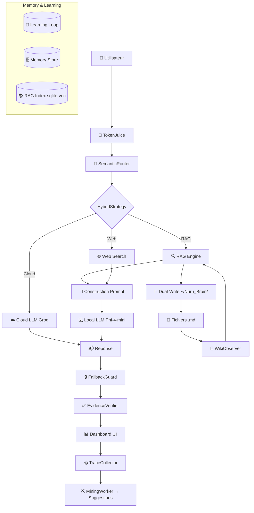

<div align="center">
  
  
  
</div>

<br/>

<h1 align="center">🌀 NURU — Assistant IA Local</h1>
<p align="center">
  <i>Personal AI for Apple Silicon — Phi-4-mini + Groq Cloud + RAG hybride + Mémoire persistante</i>
</p>

<p align="center">
  <b>Français</b> · Conçu pour MacBook Pro M1 (8 Go RAM unifiée) · <b>Privacy-first</b>
</p>

---

## ✨ Aperçu

**NURU** est un assistant IA personnel qui tourne **100% localement** sur votre Mac Apple Silicon. Il combine :

- **Un LLM local** (Phi-4-mini-instruct 4-bit via MLX) pour les réponses rapides et privées
- **Un LLM cloud** (Groq / Llama 3.3 70B) pour les tâches complexes
- **Un moteur RAG hybride** (vectoriel sqlite-vec + BM25 FTS5 + Reciprocal Rank Fusion)
- **Une mémoire persistante** avec stockage SQLite + export Markdown éditable
- **Une interface PySide6** dark mode cyberpunk (Geek & Funk)
- **Un système d'apprentissage** qui collecte les traces et s'améliore seul

> Conçu par un ingénieur agronome et informaticien, pour le terrain — des chaînes de valeur agricoles en Afrique centrale et orientale à la recherche sur Apple Silicon.

---

## 🚀 Fonctionnalités Clés

### 🤖 Modèles & Inférence

| Composant | Technologie | Détails |
|-----------|-------------|---------|
| LLM Local (principal) | **Phi-4-mini-instruct 4-bit** (MLX) | ~2.5 Go RAM, ~12 tok/s sur M1 |
| LLM Local (fallback) | **Qwen 2.5 1.5B 4-bit** (MLX) | Ultra-léger, ~1 Go RAM |
| LLM Cloud | **Groq** (Llama 3.3 70B, Gemini, DeepSeek, OpenRouter) | Avec Circuit Breaker |
| Embeddings | **multilingual-e5-base-mlx** | 768d, multilingue (FR/EN/Swahili) |
| Reranker | **cross-encoder/ms-marco-MiniLM-L6-v2** | Conditionnel (zone grise 0.40-0.75) |

### 🔍 RAG Hybride (Retrieval-Augmented Generation)

- **Stockage vectoriel** : sqlite-vec (768 dimensions)
- **Recherche textuelle** : FTS5 avec tokenizer Porter (stemming français/anglais)
- **Fusion** : Reciprocal Rank Fusion (RRF) des résultats vec + BM25
- **Requêtes** : Réécriture sémantique avant embedding
- **Seuils** : Score de confiance configurable (0.50 par défaut)
- **Guard Rails** : StrictRAGGuard (3 modes : strict/hybrid/free), EvidenceVerifier (validation des citations), FallbackGuard (blocage des hallucinations cloud)

### 🧠 Learning Loop (NURU V6)

- **TraceCollector** : Enregistre chaque interaction (query, réponse, mode, feedback) dans SQLite
- **MiningWorker** : Analyse les patterns d'échec — mauvais routage, faibles confiances, mots fréquents
- **Suggestions automatiques** : Ajustement des seuils et des prompts à partir des données réelles

### 🧃 TokenJuice — Middleware de Compression

- Réduit la consommation de tokens de **40-60%** avant envoi au LLM
- Filtres : HTML→Markdown, troncature URLs, dédup, crush logs/timestamps
- **2 points d'injection** : avant routage + après RAG
- Économise **~0.5 Go RAM** sur M1 8 Go

### 🌲 Dual-Write Mémoire

- Chaque chunk RAG est aussi écrit en Markdown dans `~/Nuru_Brain/`
- Ouverture dans **Obsidian** ou VS Code — modification manuelle possible
- Watchdog bidirectionnel : modification `.md` → ré-indexation vectorielle

### 🔀 Stratégies Hybrides Local+Cloud

| Mode | Principe | Cas d'usage |
|------|----------|-------------|
| `local_only` | Phi-4-mini répond seul (défaut) | Questions simples, conversation |
| `verify` | Phi-4-mini répond, Groq vérifie | Réponses importantes, documents |
| `plan` | Groq planifie, Phi-4-mini exécute | Tâches multi-étapes |
| `rag` (Archon) | RAG locale récupère, Groq synthétise | Documents denses, synthèse |

### 📊 Interface Cyberpunk

- Dashboard PySide6 avec **3 panneaux** : Sidebar | Chat Central | Metrics Overlay
- **Thème Geek & Funk** (Synthwave / Retro-Hacker) — violet abyssal, vert acide, rose néon
- **Métriques en temps réel** : RAM, LLM, RAG, MEM, GPU (jauges circulaires)
- **Page Système V6** : TokenJuice stats, Learning traces, Nuru_Brain fichiers, Auto-Fetch
- **Badge de stratégie** : affiche le mode actif (LOCAL / ARCHON / VERIFY / PLAN)

---

## 🏗️ Architecture



---

## 📦 Installation

### Prérequis

- **Mac Apple Silicon** (M1/M2/M3/M4)
- **Python 3.11+**
- **Homebrew** (optionnel)

### Installation rapide

```bash
# Cloner le dépôt
git clone https://github.com/leblancbahiga/nuru.git
cd nuru

# Créer l'environnement virtuel
python3 -m venv .venv
source .venv/bin/activate

# Installer les dépendances
pip install -e .

# Configurer les clés API (via Keychain macOS)
python3 -c "
import keyring
keyring.set_password('com.nuru.assistant', 'groq', 'votre_cle_groq')
keyring.set_password('com.nuru.assistant', 'gemini', 'votre_cle_gemini')
"
```

### Ou avec pip classique

```bash
pip install mlx-lm mlx-whisper mlx-embeddings \
            sqlite-vec pysqlite3 \
            pyside6 qasync \
            psutil httpx numpy \
            pymupdf python-docx loguru \
            sentence-transformers \
            sounddevice soundfile \
            watchdog pyyaml pydantic-settings \
            keyring cachetools
```

---

## 🚀 Utilisation

### Lancer le Dashboard

```bash
cd /chemin/vers/nuru
source .venv/bin/activate
python3 nuru_dashboard.py
```

### Test en ligne de commande

```bash
python3 test_ask.py
```

### Fichiers de configuration

| Fichier | Rôle |
|---------|------|
| `config/settings.yaml` | Configuration utilisateur (modèle, RAG, modes) |
| `src/config.py` | Singleton de configuration (Pydantic + YAML) |

### Clés API

Les clés sont stockées dans le **Keychain macOS** (sécurisé) :

```python
keyring.set_password("com.nuru.assistant", "groq", "gsk_...")
keyring.set_password("com.nuru.assistant", "gemini", "AI...")
keyring.set_password("com.nuru.assistant", "deepseek", "sk-...")
keyring.set_password("com.nuru.assistant", "openrouter", "sk-...")
```

---

## ⚙️ Configuration

### `config/settings.yaml` — Exemple complet

```yaml
# ─── Mode de réponse ───
# strict : docs uniquement | hybrid : docs + connaissances | free : libre
response_mode: "hybrid"

# ─── RAG ───
rag_score_threshold: 0.50
rag_score_fallback: 0.40
rag_k: 5
rag_max_context_tokens: 600

# ─── LLM ───
local_model: "mlx-community/Phi-4-mini-instruct-4bit"
local_model_fallback: "mlx-community/Qwen2.5-1.5B-Instruct-4bit"
cloud_model: "llama-3.3-70b-versatile"
cloud_provider: "groq"
cloud_fallback: "gemini-1.5-flash"

# ─── TokenJuice (V6) ───
token_juice_enabled: true
token_juice_max_chunk_chars: 2000

# ─── Learning Loop (V6) ───
learning_enabled: true

# ─── Nuru_Brain (V6) ───
nuru_brain_enabled: true
nuru_brain_watch_enabled: false

# ─── Auto-Fetch (V6) ───
auto_fetch_enabled: false
auto_fetch_interval_min: 30

# ─── Stratégie Hybride (V6) ───
# local_only | verify | plan | rag
hybrid_mode: "rag"
```

---

## 📁 Structure du Projet

```
📦 nuru/
├── 📄 nuru_dashboard.py           # Entry point PySide6
├── 📄 test_ask.py                 # Test CLI rapide
├── 📄 pyproject.toml              # Dépendances
├── 📄 NURU-V5.md                  # Documentation architecture
├── 📄 NURU-V4plus.md              # Documentation V4.5
│
├── 📂 src/
│   ├── 📂 core/                   # Pipeline principal
│   │   ├── orchestrator.py        # Route → RAG → Gen → Mémoire
│   │   ├── router.py              # SemanticRouter + HybridStrategy
│   │   ├── policies.py            # PolicyEngine (RAM, confiance)
│   │   ├── query_context.py       # Contexte immutable
│   │   ├── response_guard.py      # StrictRAGGuard (3 modes)
│   │   └── events.py              # EventBus
│   │
│   ├── 📂 ai/
│   │   └── verifier.py            # EvidenceVerifier (citations)
│   │
│   ├── 📂 rag/                    # RAG Engine
│   │   ├── chunking.py            # SemanticChunker
│   │   ├── retrieval.py           # RRF Fusion
│   │   ├── compression.py         # Compression contexte
│   │   └── citations.py           # Builder de citations
│   │
│   ├── 📂 learning/               # V6 — Learning Loop
│   │   ├── trace_collector.py     # Traces SQLite
│   │   └── miner.py               # Analyse patterns d'échec
│   │
│   ├── semantic_router.py         # Routeur 5 niveaux
│   ├── rag_engine.py              # Moteur RAG hybride
│   ├── llm_local.py               # Phi-4-mini / Qwen (MLX)
│   ├── llm_cloud.py               # Groq / Gemini / DeepSeek
│   ├── embedder.py                # MLX embeddings
│   ├── reranker.py                # Cross-encoder conditionnel
│   ├── memory_store.py            # STM + cache sémantique
│   ├── gold_memory.py             # Corrections persistantes
│   ├── token_juice.py             # V6 — Compression contexte
│   ├── nuru_brain.py              # V6 — Dual-Write Wiki
│   ├── auto_fetch.py              # V6 — Scan périodique
│   ├── ingestion.py               # Indexation documents
│   └── config.py                  # Singleton config
│
│   ├── 📂 ui/                     # Interface PySide6
│   │   ├── dashboard.py           # CyberDashboard principal
│   │   ├── styles.qss             # Thème Geek & Funk
│   │   ├── 📂 components/
│   │   │   ├── console_page.py    # Zone de chat
│   │   │   ├── v6_system_page.py  # V6 — Page Système
│   │   │   ├── settings_page.py   # Paramètres
│   │   │   ├── documents_page.py  # Gestion documents
│   │   │   ├── metric_card.py     # Cartes métriques
│   │   │   ├── circular_gauge.py  # Jauges animées
│   │   │   └── ...                # +10 autres pages
│   │   ├── 📂 state/              # Store immutable
│   │   └── 📂 viewmodels/         # ViewModels
│   │
│   └── 📂 infra/
│       └── cache.py               # TTLDecisionCache
│
├── 📂 tests/
│   ├── test_token_juice.py        # 20 tests V6
│   ├── test_v45_modules.py        # 12 tests V4.5
│   └── ...
│
├── 📂 config/
│   └── settings.yaml              # Configuration utilisateur
│
├── 📂 data/                       # Documents à indexer
├── 📂 indexes/                    # sqlite-vec DB
├── 📂 logs/                       # Logs (rotation 10 MB)
├── 📂 models/                     # Modèles MLX téléchargés
│
└── 📂 ~/Nuru_Brain/               # V6 — Wiki Markdown
    ├── 📂 sources/                # Chunks exportés
    ├── 📂 topics/                 # Résumés thématiques
    └── index.md                   # Table des matières
```

---

## 🧪 Tests

```bash
# Tests TokenJuice (20 tests)
python3 tests/test_token_juice.py

# Tests V4.5 (12 tests, 117 assertions)
python3 -m pytest tests/test_v45_modules.py -v

# Pipeline complet
python3 test_ask.py
```

---

## 🧠 Inspirations

NURU s'inspire de deux projets open source majeurs :

| Projet | ⭐ | Inspiration pour NURU |
|--------|----|-----------------------|
| [OpenJarvis](https://github.com/open-jarvis/OpenJarvis) (Stanford SAIL) | 6K+ | Learning Loop, Stratégies Hybrides, Architecture 3 piliers |
| [OpenHuman](https://github.com/tinyhumansai/openhuman) | 30K+ | TokenJuice (compression), Memory Tree, Auto-fetch, Dual-write |

---

## 📜 Licence

Ce projet est sous licence MIT — voir le fichier [LICENSE](LICENSE).

---

## 👨‍💻 Auteur

**Leblanc BAHIGA Mudarhi**  
Ingénieur agronome & informaticien  
📍 RDC (République Démocratique du Congo)  
🔗 [GitHub](https://github.com/leblancbahiga)

---

<p align="center">
  <i>Construit avec ❤️ et MLX pour Apple Silicon</i><br/>
  <b>🇫🇷 Français — 🇬🇧 English — 🇸🇾 Swahili</b>
</p>
