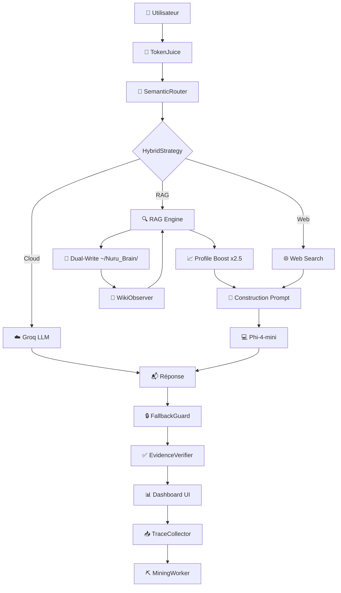

<div align="center">
  
  
  
  
  
</div>

<br/>

<h1 align="center">🌀 NURU — Assistant IA Local V8+</h1>
<p align="center">
  <i>Agentic RAG System for Apple Silicon — Multi-Strategy Search + Cloud Routing + Fact Verification</i>
</p>

<p align="center">
  <b>🇫🇷 Français</b> · Conçu pour MacBook Pro M1 (8 Go RAM unifiée) · <b>Privacy-first</b>
</p>

---

## ✨ Aperçu

**NURU V8+** est un assistant IA personnel **agentic** qui combine :
- Un **LLM local** (Phi-4-mini) pour le trivial et l'offline
- Un **LLM cloud** (OpenCode Zen, OpenRouter, DeepSeek, Groq, Nvidia) pour l'analyse documentaire
- Un **moteur RAG hybride multi-stratégie** avec RRF, HyDE, Query Rewriting, Décomposition
- Un **vérificateur de faits** post-génération
- Un système de **diagnostic temps réel** pour le débogage
- Le tout dans une **interface PySide6 cyberpunk** (anthracite, bleu, vert)

## 🚀 Fonctionnalités Clés V8+

| Composant | Technologie | Détails |
|-----------|-------------|---------|
| LLM Local (principal) | **Phi-4-mini-instruct 4-bit** (MLX) | ~2.5 Go RAM, ~12 tok/s sur M1 |
| LLM Local (fallback) | **Qwen 2.5 1.5B 4-bit** (MLX) | Ultra-léger |
| LLM Cloud | **Groq** (Llama 3.3 70B, Gemini, DeepSeek, OpenRouter) | Circuit Breaker + Fallback |
| Embeddings | **multilingual-e5-base-mlx** | 768d, multilingue (FR/EN/Swahili) |
| Reranker | **cross-encoder/ms-marco-MiniLM-L6-v2** | Conditionnel (zone grise 0.40-0.75) |

### 🔍 RAG Hybride

- **Stockage vectoriel** : sqlite-vec (768d)
- **BM25** : FTS5 avec tokenizer Porter (stemming français/anglais)
- **Fusion** : Reciprocal Rank Fusion
- **Profile Boost** : score x2.5 pour les documents personnels (CV, lettres de motivation)
- **Seuils** : `MIN_SCORE=0.40`, `FALLBACK_THRESHOLD=0.30`

### 🧠 Learning Loop

- **TraceCollector** : enregistre chaque interaction dans SQLite (queue async)
- **MiningWorker** : détecte les patterns d'échec — mauvais routage, faibles confiances
- **Rapports automatiques** : suggestions d'amélioration des seuils et prompts

### 🧃 TokenJuice — Middleware de Compression

- Réduction de **40-60%** des tokens avant envoi au LLM
- Filtres : HTML→Markdown, troncature URLs, dédup, crush logs/timestamps
- **2 points d'injection** : avant routage + après RAG
- Économie **~0.5 Go RAM** sur M1 8 Go

### 🌲 Dual-Write Mémoire (Nuru_Brain)

- Chaque chunk RAG est écrit en Markdown dans `~/Nuru_Brain/`
- Ouvrable dans **Obsidian** ou VS Code
- Modification manuelle → ré-indexation automatique

### 🔀 Stratégies Hybrides Local+Cloud

| Mode | Principe |
|------|----------|
| `local_only` | Phi-4-mini répond seul (défaut) |
| `verify` | Phi-4-mini répond, Groq vérifie |
| `plan` | Groq planifie, Phi-4-mini exécute |
| `rag` (Archon) | RAG locale récupère, Groq synthétise |

### 📥 Auto-Fetch

- Scan périodique des dossiers (Workspace, Downloads)
- Détection par hash MD5 — seuls les nouveaux fichiers sont indexés
- Désactivé par défaut (économe en RAM)

### 📊 Interface Desktop

- Dashboard PySide6 **3 colonnes** : Sidebar → Chat → Métriques + CoT
- **Thème sobre** : fond anthracite `#0D1117`, accents bleu électrique `#00A3FF`
- **Métriques temps réel** : RAM, Tok/s, Score RAG, Mode
- **Zone de raisonnement** (CoT) : affiche le chain of thought dans la colonne droite
- **Bulles Neon** : avatars avec bordure colorée, indicateur de frappe clignotant
- **Transition animée** : fondu entre les pages
- **Overlay fond** : calque sombre 25% pour lisibilité

---

## 🏗️ Architecture

```
┌─────────────────┬──────────────────────────┬──────────────────────┐
│   Sidebar        │   Chat Central            │   Colonne Métriques  │
│  (260px)         │   (QStackedWidget)        │   (320px fixe)       │
│                  │                           │                      │
│  NURU v6.0       │   🧃 TokenJuice          │   RAM 2.3/8.0G       │
│  +Nouveau Chat   │       ↓                   │   TOK/S   RAG        │
│  Base Doc.       │   🧠 SemanticRouter       │   12.5    0.72       │
│  Paramètres      │       ↓                   │   MODE local         │
│  Système V6      │   🔍 RAG + Profile Boost  │   ──────────         │
│                  │       ↓                   │   🧠 RAISONNEMENT    │
│  Raccourcis      │   💻 Phi-4-mini / ☁️ Groq  │   [CoT en direct]    │
│                  │       ↓                   │                      │
│  © 2026          │   ✅ EvidenceVerifier     │   Phi-4-mini · Groq  │
│                  │       ↓                   │                      │
│                  │   📥 TraceCollector       │                      │
│                  │       ↓                   │                      │
│                  │   🌲 Nuru_Brain/          │                      │
└─────────────────┴──────────────────────────┴──────────────────────┘
```

### Pipeline détaillé



---

## 🐛 Corrections & Optimisations V6

| # | Problème | Correctif |
|---|----------|-----------|
| 1 | **Lock Hugging Face** bloquant | `rm -rf ~/.cache/huggingface/hub/.locks/*` |
| 2 | **Event Loop bloquée** par streaming MLX | `await asyncio.sleep(0)` dans la boucle |
| 3 | **Reranker crash** sur résultat unique | `np.atleast_1d(scores)` |
| 4 | **Chargement MLX synchrone** gelait l'UI | `await asyncio.to_thread(self._load_model)` |
| 5 | **Fuite de tâches TTS** (GC tuait l'audio) | Strong references `background_tts_tasks` |
| 6 | **Timeout réseau 2s** bloquait l'UI | Réduit à **0.5s** |
| 7 | **Faux positifs RAG** (sous-chaîne "fao") | Regex `\b` (limite de mot) |
| 8 | **Extraction post-session** freeze l'UI | `asyncio.to_thread` + background task |
| 9 | **TPS faussé** (incluait TTFT) | Chrono au premier token |
| 10 | **Profile Boost** documents personnels | x2.5 CV, x2.0 attestations |

---

## 📦 Installation

```bash
# Cloner
git clone https://github.com/leblancbahiga/Assistant-IA.git
cd Assistant-IA

# Environnement
python3 -m venv .venv
source .venv/bin/activate
pip install -e .

# Clés API (via Keychain macOS)
python3 -c "
import keyring
keyring.set_password('com.nuru.assistant', 'groq', 'votre_cle')
keyring.set_password('com.nuru.assistant', 'gemini', 'votre_cle')
"
```

---

## 🚀 Utilisation

```bash
# Lancer le dashboard
cd ~/Downloads/Assistant\ IA
python3 nuru_dashboard.py

# Test rapide en CLI
python3 test_ask.py
```

### Fichiers de configuration

| Fichier | Rôle |
|---------|------|
| `config/settings.yaml` | Configuration utilisateur (modèle, RAG, modes V6) |
| `src/config.py` | Singleton Pydantic    |
| `~/.nuru/traces.db` | Traces Learning Loop |
| `~/Nuru_Brain/` | Wiki persistant V6    |

---

## ⚙️ Configuration (config/settings.yaml)

```yaml
response_mode: "strict"          # strict | hybrid | free
rag_score_threshold: 0.40
rag_k: 5
local_model: "mlx-community/Phi-4-mini-instruct-4bit"
cloud_model: "llama-3.3-70b-versatile"

# V6 — TokenJuice
token_juice_enabled: true

# V6 — Learning Loop
learning_enabled: true

# V6 — Nuru_Brain
nuru_brain_enabled: true

# V6 — Stratégie Hybride
hybrid_mode: "local_only"        # local_only | verify | plan | rag

# V6 — Auto-Fetch
auto_fetch_enabled: false
```

---

## 📁 Structure du Projet

```
📦 Assistant-IA/
├── 📄 nuru_dashboard.py          # Entry point PySide6 + daemon continu
├── 📄 test_ask.py                # Test CLI
├── 📄 README.md                  # ← Ce fichier
├── 📄 NURU-V5.md                 # Documentation architecture V5
├── 📄 pyproject.toml
│
├── 📂 src/
│   ├── 📂 core/                  # Pipeline principal
│   │   ├── orchestrator.py       # Route → RAG → Gen → Mémoire
│   │   ├── router.py             # SemanticRouter + HybridStrategy
│   │   ├── query_context.py      # Contexte immutable
│   │   ├── response_guard.py     # StrictRAGGuard (3 modes)
│   │   └── policies.py           # PolicyEngine
│   │
│   ├── 📂 learning/              # V6 — Learning Loop
│   │   ├── trace_collector.py    # Traces SQLite
│   │   └── miner.py              # Analyse patterns d'échec
│   │
│   ├── 📂 rag/                   # RAG Engine
│   │   ├── chunking.py           # SemanticChunker
│   │   ├── retrieval.py          # RRF Fusion
│   │   └── citations.py
│   │
│   ├── 📂 ui/                    # Interface PySide6
│   │   ├── dashboard.py          # CyberDashboard 3 colonnes
│   │   ├── styles.qss            # Thème sobre #0D1117
│   │   └── 📂 components/
│   │       ├── chat_bubble.py    # Bulles Neon + TypingIndicator
│   │       ├── console_page.py   # Chat + zone CoT
│   │       ├── v6_system_page.py # Page Système V6
│   │       └── settings_page.py
│   │
│   ├── token_juice.py           # V6 — Compression
│   ├── nuru_brain.py            # V6 — Dual-Write Wiki
│   ├── auto_fetch.py            # V6 — Scan périodique
│   ├── profile_boost.py         # V6 — Boost documents personnels
│   ├── rag_engine.py            # Moteur RAG hybride
│   ├── llm_local.py             # Phi-4-mini (MLX)
│   ├── llm_cloud.py             # Groq / Gemini / DeepSeek
│   └── config.py                # Singleton config
│
├── 📂 tests/
│   ├── test_token_juice.py       # 20 tests V6
│   └── test_v45_modules.py
│
├── 📂 config/
│   └── settings.yaml
│
└── 📂 ~/Nuru_Brain/              # V6 — Wiki Markdown
    ├── 📂 sources/
    ├── 📂 topics/
    └── index.md
```

---

## 🧪 Tests

```bash
python3 tests/test_token_juice.py
python3 test_ask.py
```

---

## 🧠 Inspirations

| Projet | ⭐ | Inspiration |
|--------|----|-------------|
| [OpenJarvis](https://github.com/open-jarvis/OpenJarvis) | 6K+ | Learning Loop, Stratégies Hybrides |
| [OpenHuman](https://github.com/tinyhumansai/openhuman) | 30K+ | TokenJuice, Auto-fetch, Dual-write |

---

## 📜 Licence

MIT — voir [LICENSE](LICENSE).

---

## 👨‍💻 Auteur

**Leblanc BAHIGA Mudarhi** — Ingénieur agronome & informaticien  
📍 RDC · 🔗 [GitHub](https://github.com/leblancbahiga)

---

<p align="center">
  <i>Construit avec ❤️ et MLX pour Apple Silicon</i><br/>
  <b>🇫🇷 Français — 🇬🇧 English — 🇸🇾 Swahili</b>
</p>
